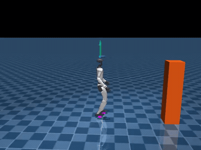
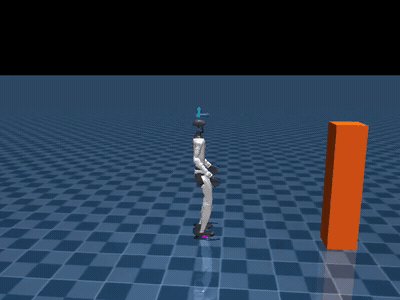
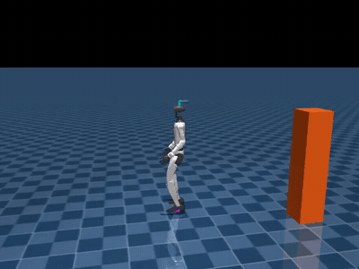
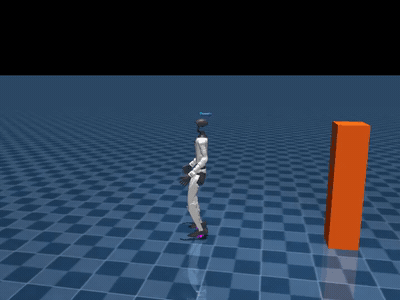
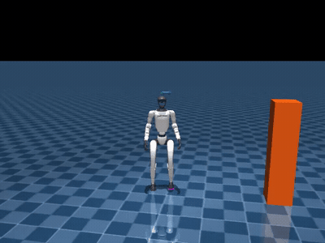
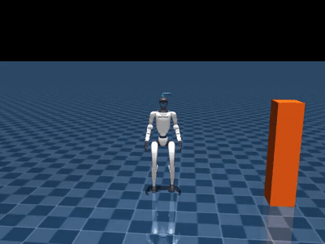

# G1 walking with CBF-RL obstacle avoidance

This package contains exactly two MJLab 1.6 tasks:

- `Velocity-Flat-Unitree-G1`: nominal locomotion.
- `Velocity-Flat-Unitree-G1-Obstacle-CBF`: the same locomotion policy with
  obstacle sensing and closed-form CBF-RL training.

Both tasks learn 15 leg/waist joint targets with normalized
`(512, 256, 128)` feed-forward actor and critic networks. The 14 arm joints
stay at the default G1 pose; arm-motion replay and hand/payload randomization
are not included.

## Method

### Nominal locomotion

The actor observes angular velocity, projected gravity, the **unmodified**
user command `[v_x, v_y, yaw_rate]`, joint state, previous actions, and four
left/right gait-phase features. The critic additionally receives root linear
velocity. The command sampler mixes direct yaw-rate, heading, forward-only,
and standing environments.

### Obstacle observation and curriculum

The obstacle task adds a collidable `0.3 x 0.3 x 1.3 m` box 1.5 m along the
sampled travel direction. Its planar position relative to the robot, expressed
in the robot's yaw frame, adds two actor and critic observations. This produces
88 actor observations and 91 critic observations, versus 86 and 89 for the
nominal task.

Training environments are split into:

- 50% obstacle-free environments;
- 25% active-obstacle environments with the ordinary sampled command;
- 25% active-obstacle environments whose nominal command is continually aimed
  at the box.

### Closed-form CBF target

Following [CBF-RL](https://arxiv.org/html/2510.14959v6), the robot and box are
circularized in the ground plane. For robot position `p`, obstacle position
`p_obs`, robot radius `r_robot = 0.35 m`, and box footprint radius
`r_obs = sqrt(0.15^2 + 0.15^2) m`, the safe set is

```text
h = ||p - p_obs|| - (r_robot + r_obs) >= 0
a = (p - p_obs) / ||p - p_obs||
```

With the raw commanded planar velocity `v_nom` and `alpha = 1.5`, the single
CBF constraint has a closed-form Euclidean projection and requires no QP:

```text
c = a^T v_nom + alpha h
v_safe = v_nom + max(0, -c) a
```

The policy never receives `v_safe`, and the user command is never overwritten.
The actor receives the raw command and the relative obstacle position, while
`v_safe` is private to two training signals:

1. The nominal linear tracking reward, with weight `2.0`, tracks `v_safe`
   instead of `v_nom`.
2. A CBF-RL reward with weight `5.0` and `sigma = 0.5` penalizes both realized
   CBF violation and deviation of actual root velocity `v` from `v_safe`:

```text
r_cbf = min(a^T v + alpha h, 0)
        + exp(-||v - v_safe||^2 / sigma^2) - 1
```

Yaw tracking and all other walking rewards remain nominal. Training
terminates when the circularized robot and obstacle footprints overlap. This
lets the policy learn the velocity filtering behavior in its action policy
without an explicit CBF or optimization layer at inference time.

The viewer arrows retain MJLab's stock meanings: dark blue is the raw linear
command, cyan is measured linear velocity, dark green is the raw yaw command,
and bright green is measured yaw velocity. The private filtered velocity is
not drawn.

## Policy comparison

The examples compare the obstacle policy against the nominal policy. Each
receives a fixed raw `0.5 m/s` command toward the initial obstacle position;
the command is not re-aimed during the rollout. To retain a tangential
component for the closed-form projection, the robot begins left of the
obstacle centerline by `0.3 m` in the front/back cases and `0.4 m` in the left
case. Each camera is computed from the selected rollout's actual root yaw and
commanded travel direction, giving a repeatable side-on view despite reset yaw
randomization.

| Obstacle placement | CBF-RL | Nominal |
| --- | --- | --- |
| Front |  |  |
| Back |  |  |
| Left |  |  |

## Install and test

```bash
uv sync
uv run pytest -q
```

## Train

The launcher defaults to the obstacle task, 4,096 environments, and periodic
checkpoints:

```bash
./train.sh 0
```

Train the nominal task with:

```bash
MJLAB_TASK_ID=Velocity-Flat-Unitree-G1 ./train.sh 0
```

## Play

The repository includes the two checkpoints used in the comparison:

- `checkpoints/nominal.pt`
- `checkpoints/obstacle_cbf.pt`

Play the obstacle-CBF policy with:

```bash
./play.sh checkpoints/obstacle_cbf.pt
```

The launcher defaults to the obstacle task. Play the nominal policy with its
matching environment:

```bash
MJLAB_TASK_ID=Velocity-Flat-Unitree-G1 \
  ./play.sh checkpoints/nominal.pt
```

Append `--viewer viser` to either command for the browser viewer.
